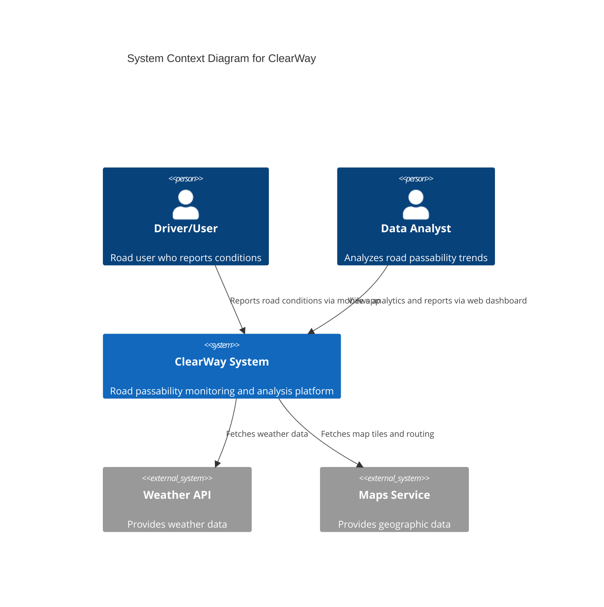
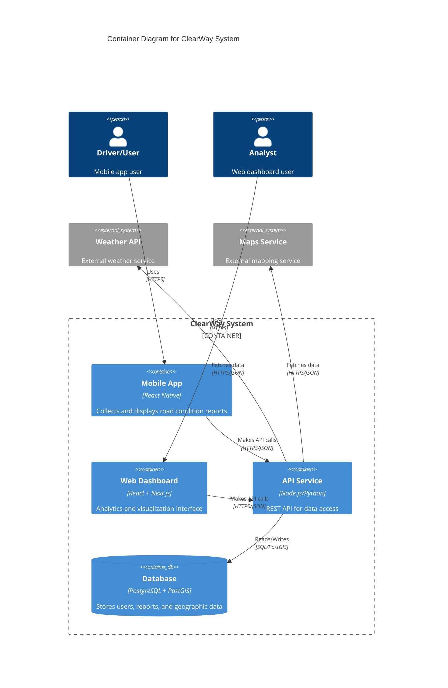
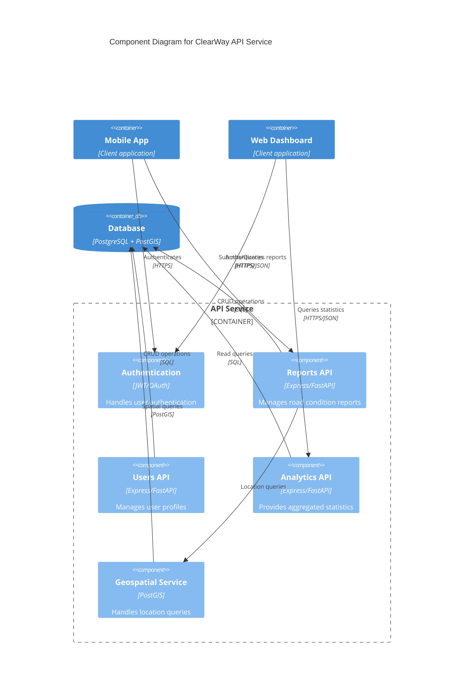
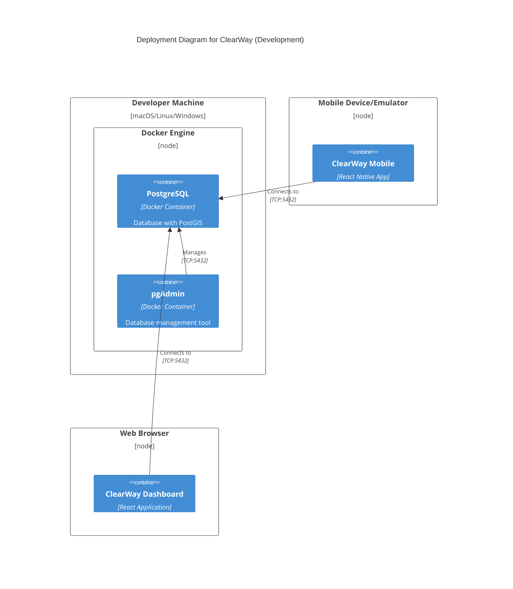
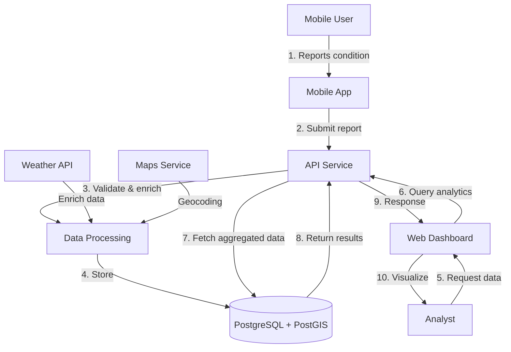

# ClearWay System Architecture (C4 Model)

## Context Diagram (Level 1)

## Container Diagram (Level 2)

## Component Diagram (Level 3) - API Service

## Deployment Diagram (Level 4)

## Data Flow Diagram

## Technology Stack

### Infrastructure Layer
- **Database**: PostgreSQL 16 with PostGIS
- **Container Orchestration**: Docker Compose
- **Database Management**: pgAdmin 4

### Data Layer
- **Spatial Queries**: PostGIS extensions
- **Data Format**: GeoJSON, WKT
- **Coordinate System**: WGS84 (EPSG:4326)

### API Layer (Future)
- **Framework**: Node.js (Express) or Python (FastAPI)
- **Authentication**: JWT or OAuth 2.0
- **API Style**: RESTful

### Client Layer (Future)
- **Mobile**: React Native or Flutter
- **Web Dashboard**: React + Next.js
- **Visualization**: Mapbox, Leaflet, Chart.js

## Architecture Principles

1. **Separation of Concerns**: Clear boundaries between data, API, and client layers
2. **Spatial First**: Built on PostGIS for efficient geographic queries
3. **Real-time Ready**: Architecture supports future WebSocket integration
4. **Scalable**: Microservices-ready design
5. **Developer-Friendly**: Docker-based local development environment

## Security Considerations

- Environment-based configuration
- Database credentials isolation
- API authentication/authorization (to be implemented)
- Input validation and sanitization
- Rate limiting for API endpoints (to be implemented)

## Performance Considerations

- Spatial indexes on geographic columns
- Materialized views for analytics
- Connection pooling
- Query optimization with EXPLAIN ANALYZE
- Caching layer (Redis) for future implementation

## Monitoring & Observability (Future)

- Application logs
- Database query performance
- API response times
- Error tracking and alerting
- User analytics
