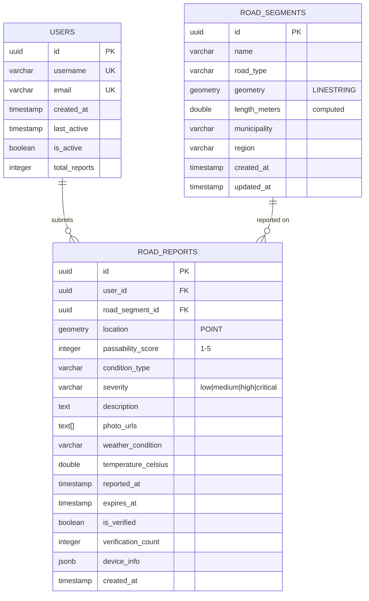

# ClearWay Database Schema Documentation

## Entity Relationship Diagram



## Tables

### 1. `users`

**Purpose**: Store information about mobile app users who submit road condition reports.

| Column | Type | Constraints | Description |
|--------|------|-------------|-------------|
| `id` | UUID | PRIMARY KEY | Unique user identifier |
| `username` | VARCHAR(50) | UNIQUE, NOT NULL | User's chosen username |
| `email` | VARCHAR(255) | UNIQUE, NOT NULL | User's email address |
| `created_at` | TIMESTAMP WITH TIME ZONE | DEFAULT NOW() | Account creation timestamp |
| `last_active` | TIMESTAMP WITH TIME ZONE | DEFAULT NOW() | Last activity timestamp |
| `is_active` | BOOLEAN | DEFAULT true | Account status |
| `total_reports` | INTEGER | DEFAULT 0 | Count of submitted reports |

**Indexes**:
- `idx_users_email` on `email`
- `idx_users_created_at` on `created_at`

**Constraints**:
- Email must match valid email format pattern

---

### 2. `road_segments`

**Purpose**: Represent physical road segments with geographic data for spatial queries.

| Column | Type | Constraints | Description |
|--------|------|-------------|-------------|
| `id` | UUID | PRIMARY KEY | Unique segment identifier |
| `name` | VARCHAR(255) | NOT NULL | Road name |
| `road_type` | VARCHAR(50) | - | Type: highway, street, rural_road |
| `geometry` | GEOMETRY(LINESTRING, 4326) | NOT NULL | Geographic line representation (WGS84) |
| `length_meters` | DOUBLE PRECISION | GENERATED | Computed length in meters |
| `municipality` | VARCHAR(100) | - | City or municipality |
| `region` | VARCHAR(100) | - | Region or county |
| `created_at` | TIMESTAMP WITH TIME ZONE | DEFAULT NOW() | Record creation time |
| `updated_at` | TIMESTAMP WITH TIME ZONE | DEFAULT NOW() | Last update time |

**Indexes**:
- `idx_road_segments_geom` (GIST) on `geometry` for spatial queries
- `idx_road_segments_municipality` on `municipality`

**Notes**:
- Uses WGS84 coordinate system (EPSG:4326)
- Length is automatically calculated using PostGIS

---

### 3. `road_reports`

**Purpose**: Store user-submitted road condition reports with location and severity data.

| Column | Type | Constraints | Description |
|--------|------|-------------|-------------|
| `id` | UUID | PRIMARY KEY | Unique report identifier |
| `user_id` | UUID | FOREIGN KEY → users(id) | Submitting user |
| `road_segment_id` | UUID | FOREIGN KEY → road_segments(id) | Associated road segment |
| `location` | GEOMETRY(POINT, 4326) | NOT NULL | Report GPS location |
| `passability_score` | INTEGER | CHECK (1-5), NOT NULL | 1=impassable, 5=fully passable |
| `condition_type` | VARCHAR(50) | - | snow, ice, flood, debris, clear |
| `severity` | VARCHAR(20) | CHECK (low/medium/high/critical) | Condition severity level |
| `description` | TEXT | - | User's description |
| `photo_urls` | TEXT[] | - | Array of photo URLs |
| `weather_condition` | VARCHAR(50) | - | Weather at report time |
| `temperature_celsius` | DOUBLE PRECISION | - | Temperature at report time |
| `reported_at` | TIMESTAMP WITH TIME ZONE | DEFAULT NOW() | When reported |
| `expires_at` | TIMESTAMP WITH TIME ZONE | - | Optional expiration |
| `is_verified` | BOOLEAN | DEFAULT false | Verification status |
| `verification_count` | INTEGER | DEFAULT 0 | Number of verifications |
| `device_info` | JSONB | - | Device metadata |
| `created_at` | TIMESTAMP WITH TIME ZONE | DEFAULT NOW() | Record creation |

**Indexes**:
- `idx_reports_location` (GIST) on `location` for spatial queries
- `idx_reports_user_id` on `user_id`
- `idx_reports_road_segment` on `road_segment_id`
- `idx_reports_reported_at` on `reported_at DESC`
- `idx_reports_passability` on `passability_score`
- `idx_reports_severity` on `severity`

**Foreign Key Actions**:
- `user_id`: ON DELETE SET NULL (preserve report if user deleted)
- `road_segment_id`: ON DELETE CASCADE (remove if road deleted)

---

## Views

### 1. `recent_reports`

**Purpose**: Pre-filtered view of reports from the last 24 hours with joined user and road data.

```sql
SELECT 
    r.*,
    u.username,
    rs.name as road_name,
    rs.road_type
FROM road_reports r
LEFT JOIN users u ON r.user_id = u.id
LEFT JOIN road_segments rs ON r.road_segment_id = rs.id
WHERE r.reported_at > CURRENT_TIMESTAMP - INTERVAL '24 hours'
ORDER BY r.reported_at DESC;
```

### 2. `road_segment_stats`

**Purpose**: Aggregate statistics for each road segment over the last 7 days.

```sql
SELECT 
    rs.id,
    rs.name,
    rs.road_type,
    rs.municipality,
    COUNT(rr.id) as total_reports,
    AVG(rr.passability_score) as avg_passability,
    MIN(rr.passability_score) as min_passability,
    MAX(rr.reported_at) as last_report_time
FROM road_segments rs
LEFT JOIN road_reports rr ON rs.id = rr.road_segment_id
    AND rr.reported_at > CURRENT_TIMESTAMP - INTERVAL '7 days'
GROUP BY rs.id, rs.name, rs.road_type, rs.municipality;
```

---

## Functions

### 1. `update_user_report_count()`

**Type**: Trigger Function  
**Purpose**: Automatically update `users.total_reports` when reports are added or deleted.

**Trigger**: `trigger_update_user_report_count`  
**Fires**: AFTER INSERT OR DELETE ON `road_reports`

---

### 2. `find_nearby_reports(lat, lon, radius_meters)`

**Type**: Query Function  
**Purpose**: Find all recent reports within a specified radius of a location.

**Parameters**:
- `lat`: Latitude (DOUBLE PRECISION)
- `lon`: Longitude (DOUBLE PRECISION)
- `radius_meters`: Search radius (INTEGER, default: 1000)

**Returns**: Table with:
- `report_id`: UUID
- `distance_meters`: Distance from query point
- `passability_score`: Score (1-5)
- `condition_type`: Condition type
- `reported_at`: Report timestamp

**Example Usage**:
```sql
-- Find reports within 2km of a location
SELECT * FROM find_nearby_reports(37.7749, -122.4194, 2000);
```

---

## Enumerations & Constants

### Passability Scores
1. **1** - Impassable (road closed or extremely dangerous)
2. **2** - Very difficult (4WD/chains required)
3. **3** - Difficult (caution required)
4. **4** - Minor issues (mostly passable)
5. **5** - Fully passable (no issues)

### Severity Levels
- `low`: Minor inconvenience
- `medium`: Moderate impact on travel
- `high`: Significant hazard
- `critical`: Emergency/road closure

### Condition Types
- `clear`: No issues
- `snow`: Snow accumulation
- `ice`: Icy conditions
- `flood`: Flooding or standing water
- `debris`: Objects on road
- `landslide`: Landslide or rockfall
- `construction`: Construction work
- `accident`: Traffic accident

---

## Sample Queries

### Get worst road conditions in last 24 hours
```sql
SELECT 
    rs.name,
    r.passability_score,
    r.severity,
    r.condition_type,
    r.reported_at
FROM road_reports r
JOIN road_segments rs ON r.road_segment_id = rs.id
WHERE r.reported_at > NOW() - INTERVAL '24 hours'
    AND r.passability_score <= 2
ORDER BY r.passability_score ASC, r.reported_at DESC;
```

### Find roads needing attention by municipality
```sql
SELECT 
    municipality,
    COUNT(*) as critical_reports,
    AVG(passability_score) as avg_score
FROM recent_reports
WHERE severity IN ('high', 'critical')
GROUP BY municipality
ORDER BY critical_reports DESC;
```

### User leaderboard (most reports)
```sql
SELECT 
    username,
    total_reports,
    created_at,
    DATE_TRUNC('day', last_active) as last_active_date
FROM users
WHERE is_active = true
ORDER BY total_reports DESC
LIMIT 10;
```

### Road segments with no recent reports
```sql
SELECT 
    rs.name,
    rs.road_type,
    rs.municipality,
    MAX(r.reported_at) as last_report
FROM road_segments rs
LEFT JOIN road_reports r ON rs.id = r.road_segment_id
GROUP BY rs.id, rs.name, rs.road_type, rs.municipality
HAVING MAX(r.reported_at) IS NULL 
    OR MAX(r.reported_at) < NOW() - INTERVAL '7 days'
ORDER BY last_report NULLS FIRST;
```

---

### 4. `target_vehicles`

**Purpose**: IZS and other vehicles whose road passability is evaluated against road segment measurements (e.g. HZS vehicles).

| Column | Type | Constraints | Description |
|--------|------|-------------|-------------|
| `id` | UUID | PRIMARY KEY | Unique identifier |
| `name` | VARCHAR(255) | NOT NULL | Vehicle designation, e.g. "CAS 24 SCANIA" |
| `category` | VARCHAR(100) | - | Service category, e.g. "hasiči", "záchranka" |
| `width` | FLOAT | CHECK > 0 | Vehicle width in meters |
| `height` | FLOAT | CHECK > 0 | Vehicle height in meters |
| `weight` | FLOAT | CHECK > 0 | Vehicle weight in tonnes |
| `length` | FLOAT | CHECK > 0 | Vehicle length in meters |
| `turning_diameter_track` | FLOAT | nullable, CHECK > 0 | Outer track turning diameter in meters (vnější stopový průměr zatáčení) |
| `turning_diameter_clearance` | FLOAT | nullable, CHECK > 0 | Outer clearance turning diameter in meters (vnější obrysový průměr zatáčení) |
| `stabilization_width` | FLOAT | nullable, CHECK > 0 | Minimum stabilization/outrigger width in meters (šířka pro patky) |
| `created_at` | TIMESTAMP WITH TIME ZONE | DEFAULT NOW() | Record creation time |

**Seeded vehicles** (HZS Plzeňský kraj, source: official requirements document):

| Name | width | height | weight | length | track_diam | clearance_diam | stab_width |
|---|---|---|---|---|---|---|---|
| CAS 15 MB ATEGO | 2.52 | 3.27 | 14.0 | 7.36 | 16.0 | — | — |
| CAS 24 TATRA 815 TERRNO | 2.55 | 3.17 | 17.5 | 8.78 | 16.5 | — | — |
| CAS 24 SCANIA | 2.55 | 3.4 | 18.6 | 7.65 | 16.0 | — | — |
| CAS 32 TATRA 815 | 2.5 | 3.35 | 22.5 | 8.51 | 19.0 | — | — |
| AP 37 IVECO MAGIRUS | 2.5 | 3.55 | 18.0 | 9.75 | — | 19.85 | — |
| AZ 52 IVECO MAGIRUS | 2.5 | 3.88 | 26.0 | 12.0 | 18.0 | 23.45 | 7.0 |

---

## Migration Strategy

### Current State
- All schema defined in `001_schema.sql`
- Sample data in `002_sample_data.sql`
- Scripts run automatically on container initialization

### Future Migrations
Create a `db/migrations/` directory for versioned changes:

```
db/migrations/
  ├── V001__initial_schema.sql
  ├── V002__add_verification_system.sql
  ├── V003__add_weather_integration.sql
  └── ...
```

**Recommended Tools**:
- [Flyway](https://flywaydb.org/)
- [Alembic](https://alembic.sqlalchemy.org/)
- [Atlas](https://atlasgo.io/)

---

## Performance Optimization

### Key Strategies
1. **Spatial Indexes**: GIST indexes on all geometry columns
2. **Partial Indexes**: Index only recent reports (e.g., last 30 days)
3. **Materialized Views**: Pre-compute expensive analytics
4. **Query Planning**: Use `EXPLAIN ANALYZE` for optimization

### Monitoring Queries
```sql
-- Find slow queries
SELECT 
    query,
    calls,
    total_time,
    mean_time
FROM pg_stat_statements
ORDER BY mean_time DESC
LIMIT 10;

-- Table sizes
SELECT 
    tablename,
    pg_size_pretty(pg_total_relation_size(schemaname||'.'||tablename)) AS size
FROM pg_tables
WHERE schemaname = 'public'
ORDER BY pg_total_relation_size(schemaname||'.'||tablename) DESC;
```

---

## Backup & Recovery

### Backup Command
```bash
# Full backup
docker-compose exec db pg_dump -U clearway clearway > backup_$(date +%Y%m%d).sql

# Compressed backup
docker-compose exec db pg_dump -U clearway clearway | gzip > backup_$(date +%Y%m%d).sql.gz
```

### Restore Command
```bash
# Restore from backup
docker-compose exec -T db psql -U clearway clearway < backup.sql
```

---

## Data Privacy Considerations

- User emails should be hashed or pseudonymized in production
- Consider GDPR "right to be forgotten" implications
- Implement data retention policies for old reports
- Anonymize location data for privacy protection
- Secure photo storage and access controls
